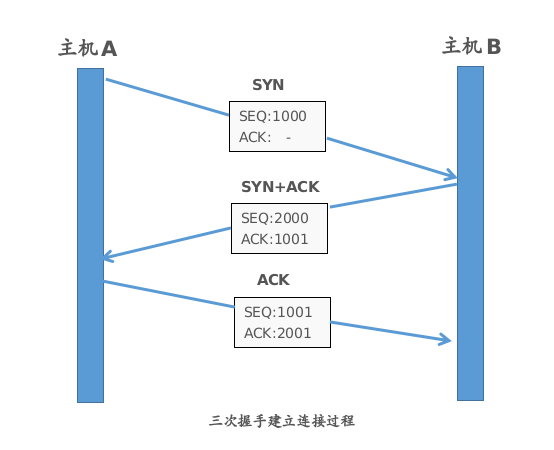
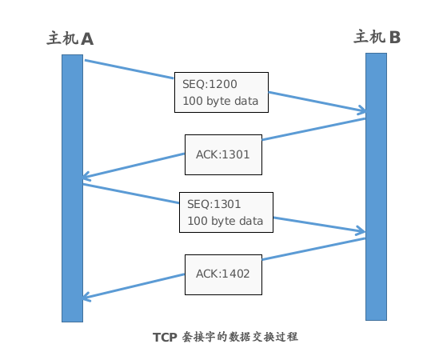
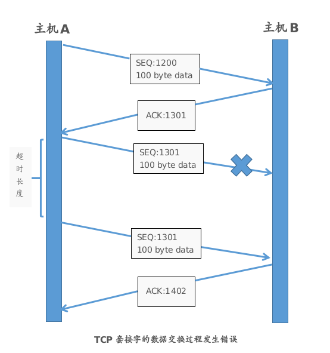

# TCP原理
## TCP套接字中的I/O缓冲
- I/O缓冲在每个TCP套接字中单独存在
- I/O缓冲在创建套接字时自动生成
- 即使关闭套接字仍然会传输遗留在输出缓冲区中的数据
- 关闭套接字会丢失输入缓冲区中的数据
## TCP内部工作原理1：与对方套接字建立连接

## TCP内部工作原理2：与对方主机的数据交换

>数据交换过程中：`ACK号 = SEQ号 + 传输的数据的字节数 + 1`

## TCP内部工作原理3：断开与对方套接字的连接

# 深入理解TCP三次握手和四次挥手过程
## 三次握手：
A:“喂，你听得到吗？”A->SYN_SEND

B:“我听得到呀，你听得到我吗？”应答与请求同时发出 B->SYN_RCVD | A->ESTABLISHED

A:“我能听到你，今天balabala……”B->ESTABLISHED

## 四次挥手：
A:“喂，我不说了。”A->FIN_WAIT1

B:“我知道了。等下，上一句还没说完。Balabala…..”B->CLOSE_WAIT | A->FIN_WAIT2

B:”好了，说完了，我也不说了。”B->LAST_ACK

A:”我知道了。”A->TIME_WAIT | B->CLOSED

A等待2MSL,保证B收到了消息,否则重说一次”我知道了”,A->CLOSED
